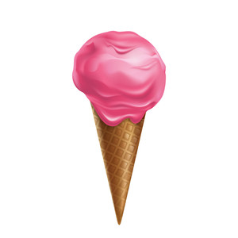

If I could create any ice-cream it would be called Candilicious!

In the very middle would be a chewy candy. It will be covered in chocolate syrup with a layer of caramelized strawberry slices. On top of that there will be vanilla ice-cream covering the strawberries and covering the vanilla ice-cream will be strawberry sauce.

It's called Candilicious because it has lots of candy. And it's delicious. Get it? Candy and Delicious... Candilicious.

And maybe if I make this ice-cream cone you can buy a different Candilicious cone and get a different flavour of ice-cream.

