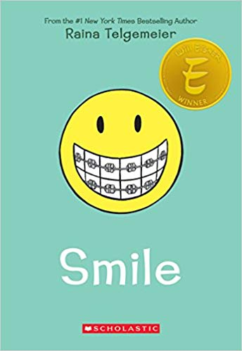

# "Smile" book review

Smile is about when the author, Raina Telgemeier, fell down and one front tooth came out and the other one was pushed in her gum.
This book is about Raina's dental drama when she was almost a teenager.
People who are nine and higher, who like Raina's other books should like this one. Around this time her friends are getting kind of mean. And some tease her about her teeth and the braces she gets.
She also had a brother named Will and a sister named Amara, who also teased her.
In her other book it talks about how she and Amara finally respected each other. That book is called "Sisters".
