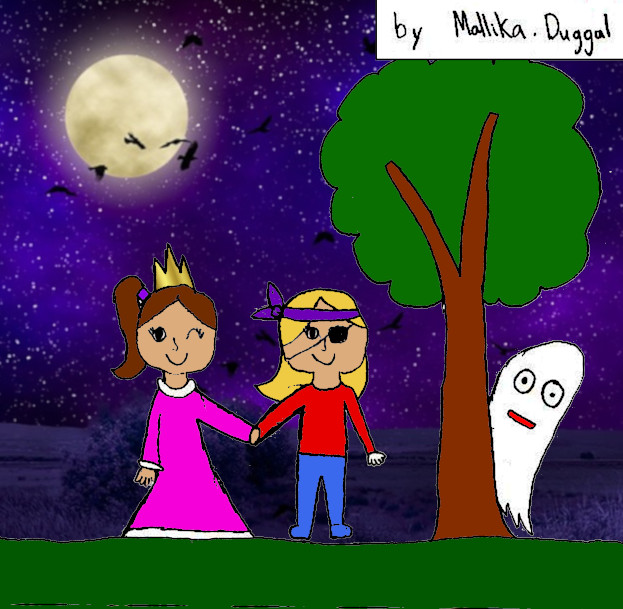

*An original story by Mallika Duggal. Written November 2018.*

The night before Halloween two best friends were talking about their fears. Emily said "I'm afraid of nothing."

On Halloween night Emily and Lily went trick-or-treating.  Lily was shy and curious but Emily was boastful. As they walked a ghost appeared and then disappeared mysteriously. "Ahhh!" cried Emily but Lily looked curious.  "What was that?" Emily said to Lily. But Lily had disappeared.

Just then a note from Lily fell and said "Help! A ghost has captured me!". 

Suddenly the ghost came, but Emily was too fast for it. She threw it to the ground and there were birds flying and a white sheet was on the ground. Just then Lily appeared from behind a spooky house and said "So you are scared of something."

THE END.

