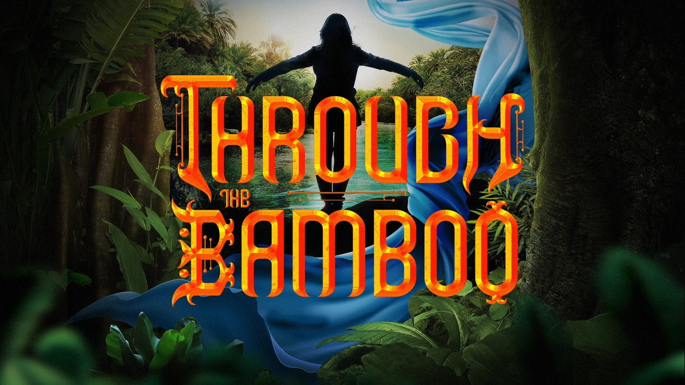

Through the Bamboo is a story about a twelve year old girl named Philly, whose
Lola (grandma) has died.  A few days after her Lola died Philly accidentally travels to the
magical land Uwi where she meets different people and creatures while she's
looking for her Lola and ending the reign of The Three Sisters.

It is a very adventurous play with some funny and sad parts twisted in it. This
play is based on a Filipino myth. The play that I saw was not high-end.  In
fact it was very awesome and amazing that I want to see it again sometime.
